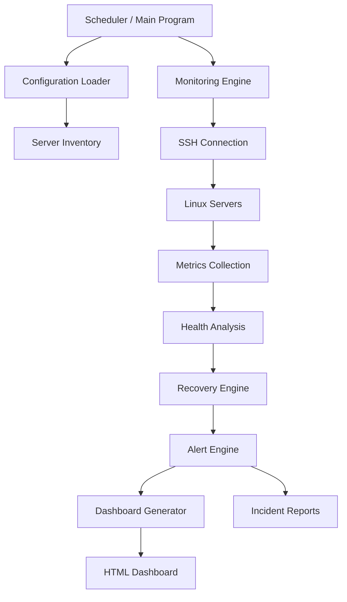
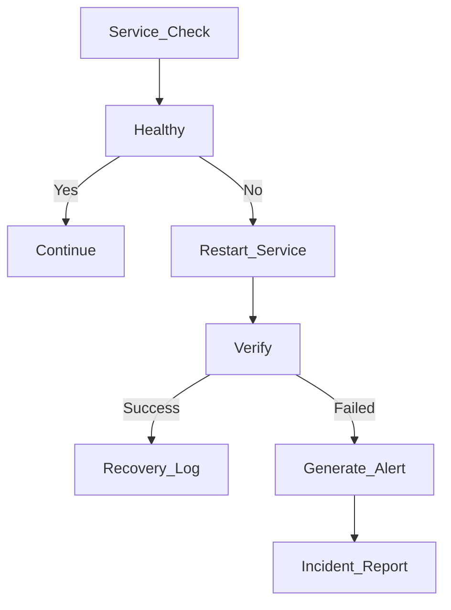
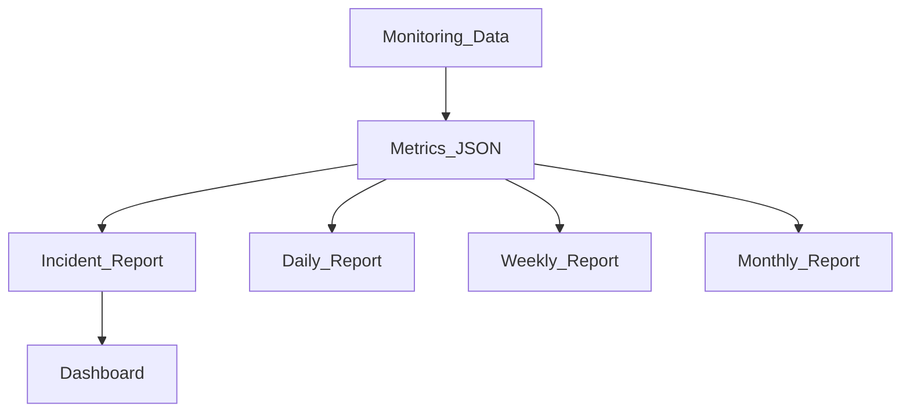

# Infrastructure Monitoring & Self-Healing Automation Platform


A Python-based infrastructure monitoring platform that continuously monitors multiple Linux servers over SSH, detects failures, performs automated recovery, generates alerts, and generates HTML dashboards and incident reports.

---

# Overview

This project automates infrastructure health monitoring for Linux servers using SSH. It periodically collects system metrics, verifies service availability, performs automatic recovery when failures are detected, stores historical metrics, and generates dashboards and reports for system administrators.

---

# Features

* Multi-server SSH monitoring
* Concurrent monitoring using ThreadPoolExecutor
* CPU monitoring
* Memory monitoring
* Disk monitoring
* Network monitoring
* Port scanning
* Service monitoring
* Automatic service recovery
* Alert generation
* Log analysis
* Incident report generation
* HTML dashboard
* Historical metrics
* Scheduled execution

---

# Architecture

## System Overview



---

## Monitoring Flow


---

## Recovery Flow



---

## Dashboard Flow


---

## Reporting Flow



---

## Technologies Used

| Category         | Technologies        |
| ---------------- | ------------------- |
| Programming      | Python 3            |
| SSH              | Paramiko            |
| Concurrency      | ThreadPoolExecutor  |
| Configuration    | YAML, JSON          |
| Logging          | Python Logging      |
| Linux Tools      | Systemd, Journalctl |
| Networking       | Requests            |
| Dashboard        | HTML                |
| Operating System | Ubuntu Server       |

---

# Repository Layout

```text
infra-monitor-platform/
│
├── README.md
├── LICENSE
├── requirements.txt
│
├── src/
│   ├── main.py
│   ├── monitor.py
│   ├── recovery.py
│   ├── dashboard.py
│   ├── reports.py
│   ├── alerts.py
│   └── scheduler.py
│
├── config/
│   └── config.yaml
│
├── inventory/
│   └── servers.yaml
│
├── dashboard/
│   └── dashboard.html
│
├── reports/
│   ├── incident_report.html
│   ├── metrics.json
│   ├── history_server1.json
│   └── alerts.log
│
├── logs/
│   └── monitoring.log
│
├── screenshots/
│   ├── dashboard.png
│   ├── incident-report.png
│   ├── alerts.png
│   └── recovery.png
│
└── tests/
    ├── test_monitor.py
    ├── test_recovery.py
    └── test_alerts.py
```

---

# Installation

```bash
git clone https://github.com/yourusername/infra-monitor-platform.git

cd infra-monitor-platform

python -m venv .venv

source .venv/bin/activate

pip install -r requirements.txt
```

---

# Configuration

Configure monitored servers:

```text
inventory/servers.yaml
```

Application settings:

```text
config/config.yaml
```

---

# Running

```bash
python src/main.py
```

---

# Scheduler

```bash
python src/scheduler.py
```

---

# Dashboard

Generated dashboard:

```text
dashboard/dashboard.html
```

Dashboard includes:

* CPU usage
* Memory usage
* Disk usage
* Network statistics
* Service status
* Alerts
* Historical metrics

---

# Reports

Generated reports include:

* incident_report.html
* metrics.json
* history_server1.json
* alerts.log
* Daily reports
* Weekly reports
* Monthly reports

---

# Stress Testing

The platform has been tested with the following scenarios:

* Stop Nginx service
* High CPU utilization
* Memory stress
* Disk full simulation
* HTTP endpoint failure
* SSH connection failure
* Automatic recovery verification

---

# Sample Output

```text
[INFO] Connecting to server1...

[INFO] CPU Usage: 24%

[INFO] Memory Usage: 47%

[WARNING] nginx service is DOWN

[ACTION] Restarting nginx...

[SUCCESS] nginx restarted successfully.

[INFO] Dashboard updated.

[INFO] Incident report generated.
```

---

# Screenshots

Add screenshots inside the **screenshots/** directory.

* Dashboard
* Incident Report
* Project Structure
* Recovery Logs
* Alert Notifications

---

# Future Improvements

* Email alerts
* Telegram notifications
* Slack integration
* Prometheus exporter
* Grafana dashboards
* Docker deployment
* Kubernetes support
* REST API
* Database backend
* Authentication & Role-Based Access Control

---

# Skills Demonstrated

* Linux Administration
* Networking Fundamentals
* SSH Automation
* Python Programming
* Concurrent Programming (ThreadPoolExecutor)
* Infrastructure Monitoring
* System Health Monitoring
* Automated Service Recovery
* Incident Detection & Response
* Structured Logging
* HTML Dashboard Generation
* Configuration Management (YAML & JSON)
* Git Version Control
* Software Architecture
* Infrastructure Automation

---

# Lessons Learned

* SSH automation with Paramiko
* Concurrent programming in Python
* Linux system administration
* Infrastructure monitoring
* Automated incident response
* Structured logging
* Modular software architecture
* Infrastructure automation best practices

---

# License

This project is licensed under the **MIT License**. See the **LICENSE** file for details.
